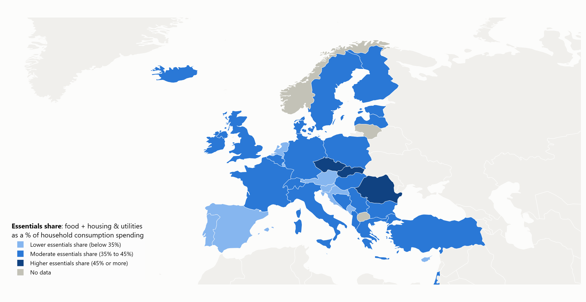

# food-housing-spending-share

How much of household spending goes to food and to housing & utilities,
across 49 OECD and European countries, 1995-2024.



*Interactive map with a year slider: `site/index.html` (draft, not yet
deployed). World view: [images/map_2024.png](images/map_2024.png).*

## The question

What share of household consumption spending goes to two basic needs, food
and housing & utilities, and how does that compare across countries and over
time?

Countries are compared against **fixed thresholds**, the same for every
country and year, not against their own past. A country changes tier only if
its share actually crosses a line.

This measures a share of **spending**, not of income. It is not an
affordability or "housing cost overburden" measure (see
[Limitations](#limitations)).

## Data

All figures are official statistics.

| Source | Dataset | Used for |
|---|---|---|
| Eurostat | `nama_10_cp18` (COICOP 2018), `nama_10_co3_p3` (COICOP 1999) | Spending by purpose, 37 European countries |
| OECD | `DSD_NAMAIN10@DF_TABLE5A_T501` (COICOP 2018), `DF_TABLE5_T501` (COICOP 1999) | 11 non-European OECD members, and the UK |
| Eurostat | `ilc_lvho07a` | Housing cost overburden rate (validation) |
| World Bank | `NY.GDP.PCAP.PP.CD` | GDP per capita, PPP (context) |

Each country comes from **one source and one classification version for its
whole series**; sources and versions are never mixed within a country.

### Why the classification (COICOP) matters

Spending is split by purpose using COICOP, which exists in a 1999 and a 2018
version. Eurostat and the OECD are both moving to the 2018 version, but
coverage is split: most EU series in the 1999 version stop in 2022, the USA
is only in the 1999 tables, Japan only in the 2018 ones. The rule used here:
COICOP 2018 where a country has it, otherwise 1999, never both.

Where both versions exist, they mostly agree (median gap 0.2-0.3 points in
recent years), but for a few countries the gap is several points, which is
enough to change a tier. Those countries carry a footnote on the map.

### Why imputed rent matters

"Housing & utilities" includes **imputed rent**: the rent owner-occupiers
would pay for their own home. No money changes hands, but national accounts
count it so that countries with many owners and countries with many tenants
can be compared. It is typically about half of the housing figure. It is the
reason the category is labelled "housing & utilities (incl. imputed rent)"
and never "rent", and why the map shows the imputed-rent share in the hover.
Countries estimate it in different ways (see Limitations).

## Method

1. **Essentials share** = (food & non-alcoholic beverages + housing &
   utilities) / total household consumption spending x 100, per country and
   year, in current prices and national currency (a ratio within one country
   does not depend on the currency). Shares are computed from the published
   amounts, not taken from published percentages, so Eurostat and OECD
   countries go through the same calculation; for Eurostat countries the
   result matches Eurostat's own published percentages within rounding.
2. **Tiers**: lower (below 35%), moderate (35% to 45%), higher (45% or
   more). The thresholds, their rationale and the checks below were
   **written down and committed before** the essentials share was computed
   for any country, so they could not be fitted to the results. They were
   kept unchanged afterwards.
3. **Checks fixed in advance**: the distribution and tier counts (with a rule
   that if more than 70% of countries fell in one tier, the thresholds would
   be reviewed; not triggered: 61%), rank correlations with the overburden
   rate and with GDP per capita, and two boundary checks.
4. **Margins near the thresholds**:
   - *Pre-registered*: the 90th percentile of the gap between COICOP versions
     (2.98 points). Applied to countries whose version gap cannot be
     observed, it flagged 217 of 417 country-years, too many to be useful.
     This result is reported as it ran.
   - *Post-hoc* (chosen after seeing that result, and labelled as such):
     **±1 point**. It drives the "near a tier boundary" flag on the map
     (252 of 1,361 country-years; 7 countries in 2024).

Every decision, with its reason and the numbers behind it, is logged in
[DATA_NOTES.md](DATA_NOTES.md). Every number there can be reproduced with the
scripts in `src/`.

## Findings

- **Tiers are robust to the classification choice.** 93.7% of country-years
  with data in both COICOP versions keep the same tier in either version
  (817 of 872, 1995-2024).
- **Food falls and housing rises with income.** Across countries, the food
  share falls steeply as GDP per capita rises (rank correlation -0.92 in
  2024) while the housing share rises (+0.50). The two partly cancel, so the
  essentials share falls with income, but less strongly (-0.43).
- **2024**: of 44 countries with data, 14 are in the lower tier, 27 moderate,
  and 3 higher (Czechia, Slovakia, Romania). The 35% line sits where
  countries are densest: 6 countries are within 1 point of it.
- **Countries far from the income trend** (2015-2024, compared with
  countries of similar GDP per capita; described, not explained):
  - **Slovakia, Finland and Czechia**: housing & utilities consistently
    well above the trend (by 6-9 points on average). Czechia's figure carries
    a classification caveat: its COICOP versions differ by up to 6.9 points,
    though even the full gap would leave it above the trend. Income explains
    only about 31% of the cross-country differences in housing share, so
    "above the trend" is a weaker statement for housing than for food.
  - **Romania**: food about 6 points above the trend.
  - **United Kingdom**: food about 5 points below the trend.
- **2020 stands out.** The lower tier shrinks from 21 countries in 2019 to 5,
  and the higher tier grows from 3 to 10. This likely reflects lower spending
  on restaurants, travel and leisure during COVID-19, which makes food and
  housing a larger share of a smaller total (cause not verified). The map
  notes this on the 2020 and 2021 frames.

## Limitations

- **Imputed rent is estimated differently across countries.** It is 22% of
  housing & utilities in Poland but 72% in Hungary, and its share barely
  relates to home-ownership rates. Removing it would reorder the housing
  ranking substantially. It is kept because it is the standard definition
  and the only one available for every country.
- **Tourist spending is in the total.** Totals cover all spending on a
  country's territory, including by foreign visitors, which lowers the
  shares in tourism-heavy countries. On a residents-only basis a 25% housing
  share would be up to 32% in Croatia and 27-28% in Greece, Portugal and
  Luxembourg. Not adjusted; flagged in the hover for six countries. Malta and
  Cyprus are probably affected but could not be measured.
- **Provisional data.** Recent years are often provisional and may be
  revised; the hover shows the flag. The OECD publishes no provisional flags
  for some series (e.g. the UK), so the absence of a flag is not evidence
  that a figure is final.
- **Kosovo cannot be shown.** The base map draws Kosovo's territory as part
  of Serbia, so that area shows Serbia's colour and data. Kosovo's own
  figures (2008-2017) are in the data download.
- **The UK is the only European country sourced from the OECD**, because
  Eurostat's UK series ends in 2019. Where both sources publish UK figures
  they differ by about 0.5 points for housing and up to 0.9 for food; the
  cause has not been established, so UK values carry this extra uncertainty.
- **Classification revisions.** For Latvia, Romania and Czechia (housing) and
  Montenegro and Bosnia and Herzegovina (food), the two COICOP versions
  differ by 4+ points (measured up to 2022). Romania's 1995-2009 figures in
  the 2018 version repeat the same shares every year and are treated as
  missing.
- **Gaps.** 2024 has data for 44 of 49 countries; 2025 is not shown because
  too few countries had published it. Very small countries are hard to see
  on the map.
- **Not an affordability measure.** The tiers correlate only weakly with
  Eurostat's housing cost overburden rate (rank correlation about 0.3), which
  compares housing costs with income and excludes imputed rent.
- **Out of scope on purpose**: healthcare, education, transport and
  income-based measures. "Essentials" here means food and housing &
  utilities only.

## Reproduce

Requires [uv](https://docs.astral.sh/uv/) and Python 3.13 (or
`pip install -r requirements.txt`). The PNG export needs Chrome or Edge.

```bash
uv sync
uv run python src/load_eurostat.py          # Eurostat, both COICOP versions
uv run python src/load_oecd.py              # OECD countries (incl. the UK)
uv run python src/combine_sources.py        # -> data/processed/shares.csv
uv run python src/check_missing_values.py   # gaps, before any plotting
uv run python src/investigate_coicop_versions.py
uv run python src/compare_eurostat_oecd.py
uv run python src/analyze_essentials.py     # tier checks
uv run python src/find_outliers.py
uv run python src/build_map.py              # -> site/index.html, images/*.png
```

Processed data is committed (`data/processed/`); raw downloads are not.
